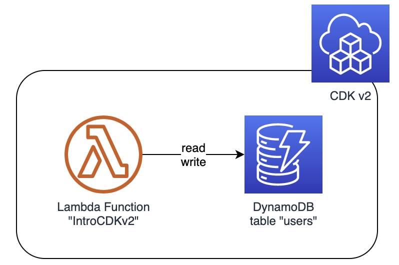

# CDK-v2-lightning-tutorial
Creating a simple CDK v2 project deploying a Lambda function and a DynamoDB table

This project adds some content to the great tutorial presented on Youtube: https://www.youtube.com/watch?v=G8yWsLDrYtY.

By using this content to can more easily benefit from the video because you do not have to manually type the stack file **introduction_to_cdk-stack.ts** from this repo.

As a quick repetition, these are the preliminary steps mentioned in the video:



* Elements to be created: a DynamoDB table named "users" and a Lambda function with permission to write to that table.
* **Install NodeJS** if not already available (see https://nodejs.dev/learn/how-to-install-nodejs)
* Perform a ```cdk bootstrap``` if you never ran CDK in the current region and get an error like **...Please run 'cdk bootstrap'...**.
* Install latest version (2.x) of CDK ```npm install -g aws-cdk```
* Create and cd into project folder,
* Initialize the project:  
    ```
    mkdir IntroductionToCDK
    cd IntroductionToCDK
    cdk init --language typescript
    ```
* most important file created is **lib/introduction_to_cdk-stack.ts** - this contains the CDK stack class!
* Do a ```cdk ls``` to check if all code is valid
* Do a ```cdk deploy``` to do a first deployment, but no specific resources will be deployed.
* If you like, make the adaptions to **lib/introduction_to_cdk-stack.ts** by using the one of this repo.
* Make sure to ```mkdir assets/``` folder and put the index.js from this repo, see details below.

I made the following improvments to the code:

* The stack file **introduction_to_cdk-stack.ts** now also contains a table removal policy DESTROY, i.e. when initiating "cdk destroy", the table is also deleted.
* The stack file now also includes Write AND Read permissions for the Lambda function to the DynamoDB table **users**
* The Lambda function now gets a specific name "IntroCDKv2" instead of that random CDK-type name.
* The stack file does no longer import a Lambda zip file, but instead every file under the ```assets/``` folder is imported - better for quick code changes!
* TO DO for you: create an ```asset/``` folder in your project (same level as ```/lib``` folder), then put the ```assets/index.js``` from this repo in there.
* The Lambda code does a simple get request to the users table, just to prove that read access is granted.

What you can do to understand the power of CDK better:

* In the stack file, change the name of the Lambda function. Do a ```cdk diff``` - you see CDK detects the change.
* Now do a ```cdl deploy```. You can lean back and see all necessary steps done - be aware that a Lambda function cannot have its name changed - instead, the whole function is re-created, along with its persmissions etc.
* Make a change to the Lambda code in assets/index.js - maybe by just adding a blank somewhere. ```cdk diff``` tells you that CDK is aware of this change.
* Put an additional file in the assets/ folder. E.g. just invoke "date > assets/text.txt". ```cdk diff``` sees it, ```cdk deploy``` will do all the needed steps: zipping all files, pushing them to the Lambda function content.
* Make a change in the Lambda code using the AWS Management Console, deploy the change. Do a ```cdk diff```. You see: CDK cannot detect this change, as it is not reflected in the visible artifacts. Be aware that the next ```cdk deploy``` will wipe your manual Lambda code changes!
